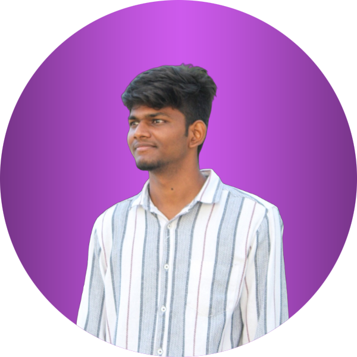

<!-- HERO / HEADER -->
<h1 align="center">
  
</h1>

  

  <strong>Full-Stack Developer</strong> — MERN • Java • SQL • Git • GitHub  
  Building responsive, performant web apps and solving problems with DSA in Java.

---

<!-- BADGES -->

  
  
  
  
  
  
  
  

---

## 📌 About Me
- 💻 Passionate **Full Stack Developer** with hands-on experience in **MERN Stack** (MongoDB, Express, React, Node.js).
- 🔹 Skilled in **Java** and currently mastering **Data Structures & Algorithms (DSA)** for problem-solving.
- 🚀 Focused on building clean, efficient, and high-performance web applications.
- 🌱 Lifelong learner — always exploring new tools and improving workflows.
- ⚡ Fun fact: I debug faster with coffee ☕.

---

## 🛠️ Technologies & Tools
**Frontend:** React, HTML5, CSS3, Tailwind, Bootstrap, JavaScript (ES6+)  
**Backend:** Node.js, Express, Java  
**Database:** MongoDB, MySQL  
**Dev Tools:** Git, GitHub, VSCode, Docker (learning)  

---

## 📈 GitHub Stats

  

  

---

## 📊 Contribution Graph

  

---

## 🏆 Badges & Competitive Coding

  
  

